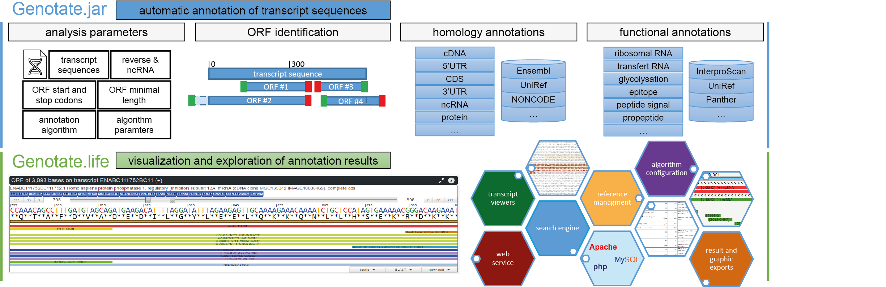

# Genotate.life: a web platform for the annotation and exploration of transcript sequences

The Genotate platform allows the automatic annotation of transcript sequences. 

Annotations can be predicted based on sequence homology and structural analyses at both the transcript and amino acid levels. Thanks to the Genotate web plaform, identified annotations can be easily visualized using interactive viewers. Furthermore, users can search for transcripts having specific features among their annotation results.



Genotate is available at [https://genotate.life](https://genotate.life) and this README explains how to install the Genotate web plaform on a local private install for users willing to customized it.

# Table of Contents

1. [Introduction](#Introduction)
2. [Installation of the Genotate web platform](#Installation)
3. [Installation of required software](#Requirement)

# <a name="Introduction"/> 1. Introduction
The Genotate web platform use the Genotate JAVA standalone application to identify homology and functional annotations on transcript sequences.

Additionally, the Genotate web platform requires a web server and a SQL DBMS to allow the visualization and exploration of annotation results.

# <a name="Installation"/> 2. Installation of the Genotate web platform 

The Genotate web platform can be downloaded using the following commands:
```
mkdir /var/www/genotate.life
cd /var/www/genotate.life
git clone --depth 1  https://github.com/tchitchek-lab/genotate.life
mv genotate.life web
```

The Genotate web plafoform needs some specific subfolders to work:
 * the 'web' folder contains the HTML, PHP, CSS and js files necessary to the website.
 * the 'binaries' folder contains the genotate.jar and genotate.config files
 * the 'services' folder contains the tools used to run genotate.jar
 * the 'tmp' contains folder the temporary analysis result files.
 * the 'workspace/blastdb' folder contains the homology references.
 * the 'workspace/storage' folder contains the annotation analysis results files.
 * the 'workspace/config' folder contains the database.config file (with the MySQL user, pass, and the name of Genotate database).

# <a name="Overview"/> 3. Installation of required software

## Installation of the Apache web server and PHP

The Apache web server and PHP can be installed using the following commands:
```
sudo apt-get update
sudo apt-get install apache2
sudo apt-get install apache2 apache2-utils
sudo apt install php
apt install libapache2-mod-php7.0
apt-get install php7.0-mysqli
```

The apache virtual host file (available at /etc/apache2/sites-available) needs to be configured to specify the Genotate web files.
```
<VirtualHost *:80>
    ServerAdmin webmaster@localhost
    DocumentRoot /var/www/genotate.life/web
    ErrorLog ${APACHE_LOG_DIR}/error.log
    CustomLog ${APACHE_LOG_DIR}/access.log combined
</VirtualHost>
```

The apache server must be restarted to take into account the modifications, using the following command:
```
sudo service apache2 restart
```

## Installation of the MySQL DBMS server

The MySQL DBMS server can be installed using the following commands:
```
curl -OL https://dev.mysql.com/get/mysql-apt-config_0.8.3-1_all.deb
dpkg -i mysql-apt-config*
sudo apt-get update
sudo apt-get install mysql-server
```

## Installation of the Oracle JAVA interpeter

A JAVA interpreter is reqired to run the Genotate standalone application.

We suggest to use the Oracle JAVA interpreter, witch can be downloaded at [https://www.java.com](https://www.java.com/fr/download/linux_manual.jsp).

Please install the JAVA interpreter in the 'services/java/bin/java' folder.

## Installation of the genotate.jar standalone application

To install the Genotate standalone annotation please go at: [https://github.com/tchitchek-lab/genotate.jar](https://github.com/tchitchek-lab/genotate.jar).

## Installation of the postfix system

The Genotate web plaform can notify users by emails when annotation analyses are finished. 

We  suggest to use the postfix system, which can be installed using the following command:
```
apt-get install postfix
```
