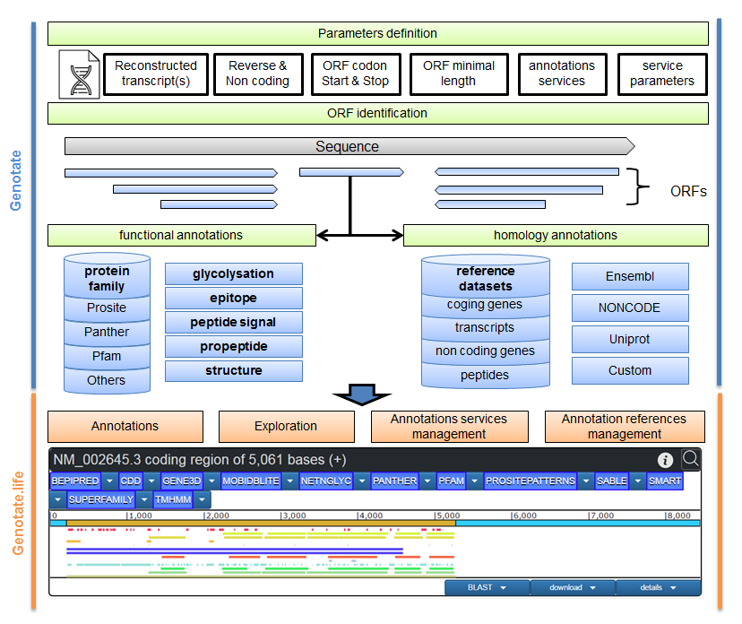

# Genotate.life: a web platform for the annotation and exploration of transcript sequences

The Genotate platform allows the automatic annotation of transcript sequences. Annotations can be predicted based on sequence homology and structural analyses at both the transcript and amino acid levels. Identified annotations can be easily visualized using interactive viewers. Furthermore, users can search for transcripts having specific features among their annotation results.
Genotate is available at [https://genotate.life](https://genotate.life).


# Table of Contents

1. [Introduction](#Introduction)
2. [Installation of the Genotate web platform](#Installation)
3. [Installation requirements](#Requirement)

# <a name="Introduction"/> 1. Introduction

Genotate website allows to access automatic annotation pipeline for transcript sequence anywhere, and the access to annotated sequences for exploration.
Genotate use an Apache server to access HTML files from the web.

Genotate use Genotate annotation software to annotate the transcript sequences.
Homology annotation databases can be created and managed, using Ensembl transcriptomes and proteomes, UniProt proteomic databases, or custom sequences.

Genotate searches all the ORF and annotates them using similarity to other sequences and functional domains.
The tools parameters can be modified through the website.




# <a name="Installation"/> 2. Installation of the Genotate web plafoform 

The Genotate web plafoform can be downloaded using the following commands:
```
mkdir /var/www/genotate.life
cd /var/www/genotate.life
git clone --depth 1  https://github.com/tchitchek-lab/genotate.life
mv genotate.life web
```

The Genotate web plafoform needs some specific subfolders to work:
 * the 'web' folder contains the HTML, PHP, CSS and js files necessary to the website.
 * the 'binaries' folder contains the genotate.jar and genotate.config files
 * the 'services' folder contains the tools used to run genotate.jar
 * the 'tmp contains' folder the temporary analysis results.
 * the 'workspace/blastdb' folder contains the homology references.
 * the 'workspace/storage' folder contains the annotation analysis results files generated by Genotate.
 * the 'workspace/config' folder contains the database.config file with the MySQL user, pass and the name of Genotate database.

Genotate can notify users by mails when annotation analyses are finished. The postfix  system needs to be installed using the following command:
```
apt-get install postfix
```

# <a name="Overview"/> 3. Installation requirements

The Genotate web platform use the Genotate JAVA standalone application to identify homology and functional annotations on transcript sequences.

Additionally, the Genotate web platform requires a web server and a SQL DBMS. We suggest to use Apache server and MySQL server.

## Installation of the Apache web server and Php

The Apache web server and PhP can be installed using the following commands:
```
sudo apt-get update
sudo apt-get install apache2
sudo apt-get install apache2 apache2-utils
sudo apt install php
apt install libapache2-mod-php7.0
apt-get install php7.0-mysqli
```

The apache virtual host file (available at /etc/apache2/sites-available) needs to be configured to specify the Genotate web files.
```
<VirtualHost *:80>
    ServerAdmin webmaster@localhost
    DocumentRoot /var/www/genotate.life/web
    ErrorLog ${APACHE_LOG_DIR}/error.log
    CustomLog ${APACHE_LOG_DIR}/access.log combined
</VirtualHost>
```

The apache server must be restarted to take into account the modifications, using the following command:
```
sudo service apache2 restart
```

## Installation of the MySQL DBMS server

The MySQL DBMS server can be installed using the following commands:
```
curl -OL https://dev.mysql.com/get/mysql-apt-config_0.8.3-1_all.deb
dpkg -i mysql-apt-config*
sudo apt-get update
sudo apt-get install mysql-server
sudo mysqladmin -u root password newpass -p oldpass
```

## Installation of the Oracle JAVA interpeter

A JAVA interpreter is reqired to run the Genotate standalone interpreter.
The Oracle JAVA interpreter can be downloaded at [https://www.java.com](https://www.java.com/fr/download/linux_manual.jsp).

Please install the JAVA interpreter in the 'services/java/bin/java' folder.

## Installation of the genotate.jar standalone application

Genotate need to be installed and configured to launch annotation from Genotate website.

To install Genotate annotation tool please go to [Genotate Github](https://github.com/tchitchek-lab/genotate).

Any folder name and website name can be used, it will not affect genotate functions.
The user right needs to be configured to allow apache to execute genotate, services, and create files.

